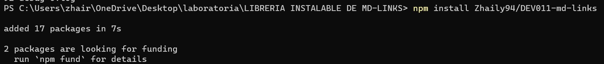
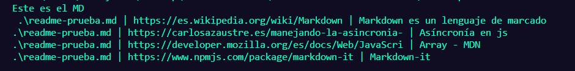
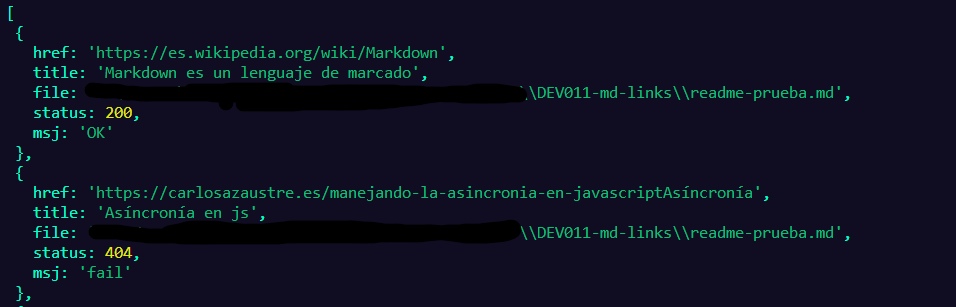
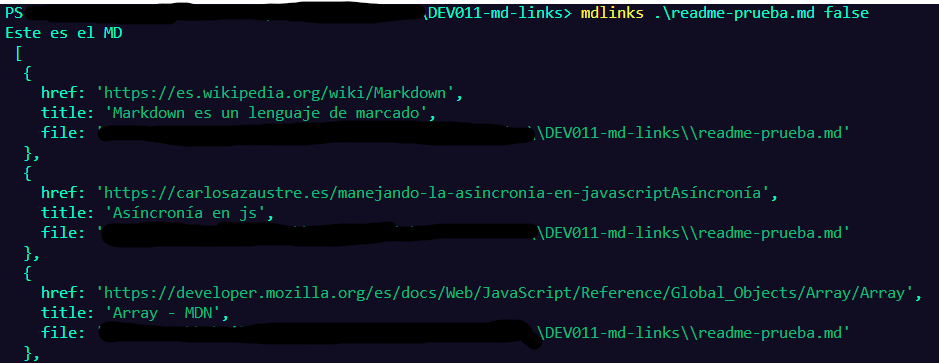
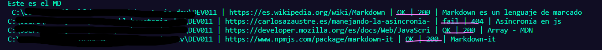
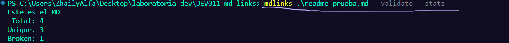

# Markdown Links

## Índice

* [Resumen del proyecto](#resumen-del-proyecto)
* [Consideraciones generales](#consideraciones-generales)
* [Instalacion](#instalacion)
* [Funcionamiento](#Funcionamiento)

## Resumen del proyecto

El proyecto se centra en una librería creada en Node.js con el propósito específico de analizar y gestionar enlaces dentro de archivos markdown. Esta herramienta es fácilmente accesible a través de NPM (Node Package Manager), permitiendo una instalación rápida y sencilla desde su registro oficial o incluso directamente desde GitHub.

Su funcionalidad principal se enfoca en la validación de enlaces, ofreciendo un análisis exhaustivo para determinar si están activos o rotos, brindando así un informe detallado sobre su estado. Esta capacidad es de gran utilidad para los desarrolladores y editores de contenido que trabajan con archivos markdown, ya que garantiza la precisión y confiabilidad de los enlaces dentro de sus documentos.

Además, esta librería se distingue por su interfaz de línea de comandos, lo que significa que puede ser fácilmente operada desde la terminal mediante un menú interactivo. Esta funcionalidad facilita su uso y permite a los usuarios ejecutar comprobaciones de enlaces sin complicaciones, todo directamente desde la línea de comandos.

Al compartir el código en un repositorio público, este proyecto se convierte en una herramienta colaborativa, ofreciendo la oportunidad para otros desarrolladores de contribuir, mejorar y utilizar la librería en sus propios proyectos, fomentando así la comunidad de desarrollo de software.


## Consideraciones generales

El proyecto anterior se basó principalmente en Node.js en su versión 16. Para su correcto funcionamiento, requiere tener instaladas algunas herramientas clave: Node.js y npm para la gestión de paquetes, Axios para las solicitudes de red, Jest para las pruebas unitarias y Markdown-it para la interpretación de documentos markdown.

La configuración con Node.js en su versión 16 fue esencial para el desarrollo, mientras que la presencia de Axios permitió realizar solicitudes HTTP para verificar el estado de los enlaces. Jest se utilizó para llevar a cabo pruebas exhaustivas y garantizar la estabilidad y precisión del código. Además, la integración de Markdown-it fue fundamental para la interpretación fluida y precisa de archivos markdown, convirtiéndolos de manera fiable a HTML.

Por ende, para el uso óptimo de esta librería, se requiere tener instalados y configurados Node.js, npm, Axios, Jest y Markdown-it. Estas herramientas son fundamentales para asegurar un funcionamiento adecuado y completo de la librería, permitiendo a los usuarios aprovechar al máximo su funcionalidad.


### Descripción de los archivos del proyecto

* `README.md` archivo markdown con descripcion del módulo, instrucciones de instalación/uso,
  documentación del API y ejemplos. Todo lo relevante para que cualquier
  developer que quiera usar la librería pueda hacerlo sin inconvenientes.
* `index.js`: Desde este archivo debes exportar varias funciones (`mdLinks`).
* `package.json` contiene el nombre, versión, descripción, autores, licencia,
  dependencias, scripts, main, bin
* `.editorconfig` con configuración para editores de texto. Este archivo no se
  debe cambiar.
* `.eslintrc` con configuración para linter. Este archivo contiene una
  configuración básica para ESLint, si deseas agregar reglas adicionales
  como Airbnb deberás modificar este archivo.
* `.gitignore` para ignorar `node_modules` u otras directorios que no deban
  incluirse en control de versiones (`git`).
* `test/md-links.spec.js` contiene los tests unitarios para la función
  `mdLinks()`.

## Instalacion
Para la instalacion es necesario crear una carpeta donde se guardara esta libreria y ejecutar el siguiente comando

```shell

npm install Zhaily94/DEV011-md-links

```
Si todo esta correcto se mostrara de la siguiente forma.



## Funcionamiento
La estructura del comando es sencilla: se compone del nombre de nuestra librería seguido de la ruta del archivo a analizar. Esta ruta puede ser tanto absoluta como relativa, ya que la librería se encarga de convertirla automáticamente en una ruta absoluta, como lo requiere Node.

```shell
mdlinks .\tu-archivo-markdown.md
```
La respuesta generada presenta la ruta del archivo analizado, el enlace identificado y el texto asociado a dicho enlace. Esta estructura de respuesta permite identificar claramente la ubicación del archivo, el enlace encontrado y el texto adjunto al enlace para un análisis detallado.



Para obtener información detallada sobre los enlaces encontrados, podemos usar la siguiente estructura de comando. Esta nos permite validar los enlaces identificados y obtener datos más específicos sobre su estado y funcionamiento.

```shell
mdlinks .\tu-archivo-markdown.md true
```

Tras ejecutarlo, obtenemos la siguiente respuesta, donde cada objeto presenta propiedades como 'href' (el enlace), el texto descriptivo de cada enlace y la ruta del archivo donde se halló dicho enlace. Esta estructura ofrece información detallada sobre los enlaces encontrados.

  * href: URL encontrada.
  * text: Texto que aparecía dentro del link.
  * file: Ruta del archivo donde se encontró el link.
  * status: Código de respuesta HTTP.
  * ok: Mensaje fail en caso de fallo u ok en caso de éxito.



Si la validacion es false el resultado que nos arroja es el siguiente

```shell
mdlinks .\tu-archivo-markdown.md false
```
  * href: URL encontrada.
  * text: Texto que aparecía dentro del link.
  * file: Ruta del archivo donde se encontró el link.

  

Una de las opciones adicionales es utilizar '--validate', que realiza una solicitud HTTP para determinar la funcionalidad del enlace identificado en el markdown. Si el enlace es una redirección y responde con un 'ok', se considera que el enlace está activo y funcionando correctamente.

```shell
mdlinks .\tu-archivo-markdown.md --validate
```

Vemos que el output en este caso incluye la palabra ok o fail después de la URL, así como el status de la respuesta recibida a la petición HTTP a dicha URL.



Si pasamos la opción --stats el output (salida) será un texto con estadísticas básicas sobre los links.

```shell
mdlinks .\tu-archivo-markdown.md --stats
```

También podemos combinar --validate y --stats para obtener estadísticas que necesiten de los resultados de la validación.

```shell
mdlinks .\tu-archivo-markdown.md --validate --stats
```

